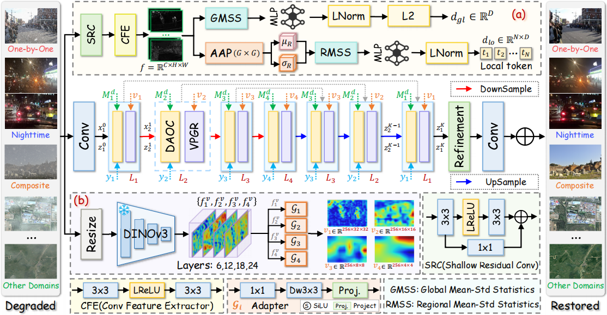

<h1 align="center">DVANet: Degradation-aware Visual-prior Alignment Network for Image Restoration</h1>

<p align="center">
  <a href="https://github.com/leoyjTu">Yanjie Tu</a><sup>1</sup>,
  <a href="https://scholar.google.com/citations?user=BSGy3foAAAAJ&hl=en">Qingsen Yan</a><sup>1,2,*</sup>,
  <a href="https://scholar.google.com/citations?user=5apnc_UAAAAJ&hl=en&oi=ao">Axi Niu</a><sup>1</sup>,
  <a href="https://scholar.google.com/citations?user=BNkFUbsAAAAJ&hl=en">Tao Hu</a><sup>1</sup>,
  <a href="https://scholar.google.com/citations?hl=en&user=m3gPwCoAAAAJ">Haokui Zhang</a><sup>1</sup>,
  <a href="https://scholar.google.com/citations?hl=en&user=mcROAxAAAAAJ">Jiantao Zhou</a><sup>3</sup>
</p>

<p align="center">
  <sup>1</sup>Northwestern Polytechnical University&nbsp;&nbsp;
  <sup>2</sup>Shenzhen Research Institute of Northwestern Polytechnical University&nbsp;&nbsp;
  <sup>3</sup>University of Macau<br>
  <sup>*</sup>Corresponding Author
</p>

<!--
<p align="center">
  <a href="https://leoyjtu.github.io/tpgdiff-project/">🌐 Project Page</a> |
  <a href="https://arxiv.org/abs/2601.20306">📜 Arxiv</a>
</p>
-->

---

## 🔥 Update Log

* 📢 This repository is released.

## 📖 Method Overview

<p align="center">
  
</p>

Overall architecture of DVANet. Given a degraded image, DVANet extracts two types of auxiliary cues:
(a) global-local degradation representations from the degradation representation block, and
(b) hierarchical visual priors from the frozen DINOv3 encoder with lightweight prior adapters.
These cues are then used to guide the degradation-aware observation consistency update and visual-prior-guided reconstruction in the dual-variable unfolding process.

## 🛠️ Environment Setup

We recommend using conda to create a clean environment.

```bash
conda create -n dvanet python=3.10 -y
conda activate dvanet
```

Install PyTorch with CUDA 11.8:

```bash
pip install torch==2.4.0+cu118 torchvision==0.19.0+cu118 torchaudio==2.4.0+cu118 --index-url https://download.pytorch.org/whl/cu118
```

Install other dependencies:

```bash
pip install -r requirements.txt
```

## Pre-trained Weights (Baidu Netdisk)

For the DINOv3 pre-trained weight, please download it from [Baidu Netdisk](https://pan.baidu.com/s/1bqI9sWDIUGw43_mqF4JstA?pwd=4szd) (extraction code: `4szd`) and place it under `dinov3/weights/`.

The expected file structure is:

```text
dinov3/
└── weights/
    └── dinov3_vitl16_pretrain_sat493m-eadcf0ff.pth
```

## ⬇️ Dataset Preparation

This repository contains two experimental settings:

* `Multi_Noise_Denoising`: image denoising under different noise levels.
* `Single_Composite_Degradation`: image restoration under single and composite degradation settings.

### 1. Dataset Structure for `Multi_Noise_Denoising`

For the denoising task, the expected training data structure is:

```text
data/
└── Train/
    └── Denoise/
        ├── 00001.bmp
        ├── 00002.bmp
        ├── 5096.jpg
        ├── 6046.jpg
        └── ...
```

The testing data should be placed under:

```text
data/
└── test/
    └── denoise/
        └── bsd68/
            ├── 101085.png
            ├── 101087.png
            └── ...
```

During evaluation, noisy images are generated on-the-fly from clean test images with the specified noise levels, such as sigma = 15, 25, and 50.

### 2. Dataset Structure for `Single_Composite_Degradation`

For single and composite degradation restoration, the expected dataset structure is:

```text
datasets/
├── CDD/
│   ├── train/
│   │   ├── clear/
│   │   │   ├── 00012.png
│   │   │   └── ...
│   │   └── input/
│   │       ├── snow_00012.png
│   │       ├── haze_snow_00015.png
│   │       └── ...
│   └── test/
│       ├── clear/
│       │   ├── 00008.png
│       │   └── ...
│       └── input/
│           ├── snow_00008.png
│           ├── haze_snow_00008.png
│           └── ...
├── lol-blur/
│   ├── train/
│   │   ├── blur/
│   │   │   ├── 0000_0011.png
│   │   │   └── ...
│   │   └── gt/
│   │       ├── 0000_0011.png
│   │       └── ...
│   └── test/
│       ├── blur/
│       │   ├── 0012_0011.png
│       │   └── ...
│       └── gt/
│           ├── 0012_0011.png
│           └── ...
└── CSD/
    ├── train2500/
    │   ├── Gt/
    │   │   ├── 1.tif
    │   │   └── ...
    │   └── Snow/
    │       ├── 1.tif
    │       └── ...
    └── test2000/
        ├── Gt/
        │   ├── 1.tif
        │   └── ...
        └── Snow/
            ├── 1.tif
            └── ...
```

Dataset download links will be released soon.

## 🚀 Training

### 1. Training for `Multi_Noise_Denoising`

Enter the denoising directory:

```bash
cd Multi_Noise_Denoising
```

Train the model for denoising with multiple noise levels:

```bash
CUDA_VISIBLE_DEVICES=0,1,2,3 python train.py --de_type denoise_15 denoise_25 denoise_50
```

Here, `denoise_15`, `denoise_25`, and `denoise_50` denote Gaussian denoising tasks with different noise levels.

### 2. Training for `Single_Composite_Degradation`

Enter the `Single_Composite_Degradation` directory:

```bash
cd Single_Composite_Degradation
```

Train the model with a specific task configuration:

```bash
bash train.sh options/{task}.yml
```

For example, to train on the low-light enhancement task, run:

```bash
bash train.sh options/LOL.yml
```

Other tasks can be trained by replacing `{task}.yml` with the corresponding configuration file in the `options/` directory.

## 🌍 Evaluation

### 1. Evaluation for `Multi_Noise_Denoising`

Enter the denoising directory:

```bash
cd Multi_Noise_Denoising
```

Before evaluation, please place the model checkpoint file under the `ckpt/` directory.

Run denoising evaluation:

```bash
python test.py --mode 0
```

Here, `--mode 0` denotes the denoising evaluation setting.

### 2. Evaluation for `Single_Composite_Degradation`

Enter the `Single_Composite_Degradation` directory:

```bash
cd Single_Composite_Degradation
```

Run evaluation:

```bash
python eval.py
```

Calculate quantitative metrics:

```bash
python metrics.py
```

## ✨ Qualitative Results

<summary><strong>Visual comparison under the composite degradation.</strong></summary>
<br>
<p align="center">
  
</p>

<summary><strong>Visual comparison under the NightRain degradation.</strong></summary>
<br>
<p align="center">
  
</p>


## 💖 Acknowledgment

This project is based on [Restormer](https://github.com/swz30/Restormer), [BioIR](https://github.com/c-yn/BioIR/tree/main), and [VLU-Net](https://github.com/xianggkl/VLU-Net/tree/master). We sincerely thank the authors for their excellent works.

## 🤝🏼 Citation

If this code contributes to your research, please cite our work:

```bibtex
@article{XXX,
  title={DVANet: Degradation-aware Visual-prior Alignment Network for Image Restoration},
  author={XXX},
  journal={XX},
  year={2026}
}
```

## 🔆 Contact

If you have any questions, please feel free to contact me at [yanjietu@mail.nwpu.edu.cn](mailto:yanjietu@mail.nwpu.edu.cn).
